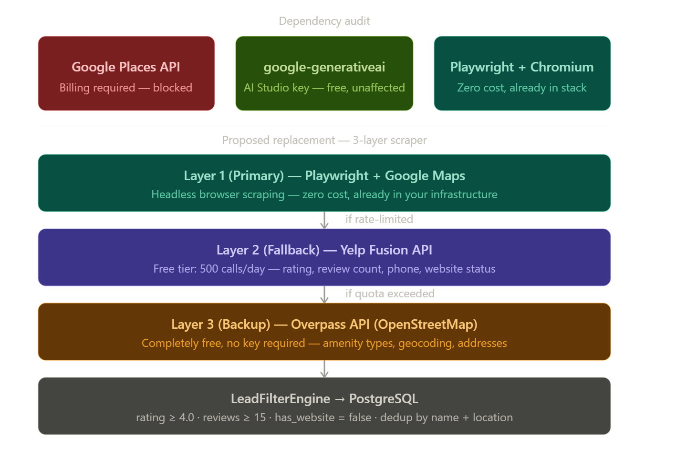

This is a well-defined architectural problem and the situation is actually less severe than it appears. Let me give you a structured Chief Architect analysis before any implementation decisions are made.Good. This is a well-defined blocker and the diagnosis is faster than you might expect. Let me give you the full architectural assessment before recommending any code changes.

Dependency Analysis: What Is Actually Blocked
Before panicking, you need to understand which Google product is blocked vs. which is not. These are two entirely separate billing systems.
1. google-generativeai (Gemini Flash — your Validator Agent)
This package connects to Google AI Studio, not Google Cloud. AI Studio has its own standalone free API key at aistudio.google.com — no Cloud project, no billing account, no credit card. This dependency is completely unaffected. You can continue using Gemini 2.0 Flash as your Validator Agent at zero cost today.
2. Google Places API (your Scraper — Layer 1)
This is a Google Maps Platform product billed through Google Cloud. This is the only blocked dependency. Your entire pivot is about replacing this one component.

The Playwright Situation: Your Hidden Advantage
You already have Playwright + Chromium in your infrastructure from Phase 1 as a "Layer 2 fallback." That was written as a safety net. It now becomes your primary engine. This is not a downgrade — scraping Google Maps directly with a headless browser returns more data than the Places API does (including photo URLs, full review text, and business attributes), and has zero API cost. The tradeoff is that it requires careful rate limiting and is more brittle to DOM changes.

Here is the full picture of your current dependency status and the proposed architecture to replace the one blocked component:
